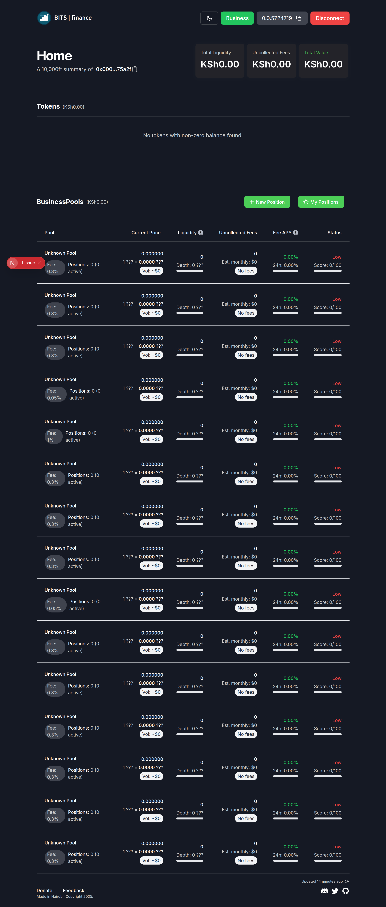

# Token Market Platform

A decentralized platform built on Hedera blockchain enabling SMEs (Small, Medium, and Micro Enterprises) to raise funding through tokenization against Bitcoin and HBAR using automated market maker (AMM) algorithms.


<div style="display:inline-block;">



</div>

## 🚀 Features

- **Hedera Integration**: Leveraging Hedera's secure, fast, and low-cost network
- **Tokenization**: Businesses can issue tokens against Bitcoin or HBAR
- **Automated Market Making**: Token prices are balanced automatically using standard AMM algorithms
- **Direct Pool Management**: 
  - Business payments received directly into the liquidity pool
  - Payments made directly from the pool
  - No direct fund access by business managers
- **Investment Positions**: Users can buy into business liquidity pools and withdraw anytime
- **Transparent Operations**: Real-time visibility of profits and losses

## 💫 Hedera Blockchain Integration

This project is built as part of the Hedera Blockchain Hackathon, focusing on bringing innovative financial solutions to SMEs in Africa.

<span>Testnet Contract: <a href="https://hashscan.io/testnet/contract/0.0.5808181">0.0.5808181</a></span> 
      
<span>Mainnet Contract: <a href="https://hashscan.io/mainnet/contract/0.0.xxxxxxx">0.0.xxxxxxx</a></span> 
      


*Building the future together with Hedera and Nairobi Securities Exchange*

## 🛠️ Technology Stack

- Hedera Network & SDKs
- Node.js
- TypeScript
- Next.js
- Docker

## 📋 Prerequisites

- Node.js 18.x or higher
- Yarn package manager
- Docker (for containerized deployment)
- Git
- Hedera testnet account

## 🚀 Getting Started

### Local Development

```bash
# Clone the repository
git clone https://git.bitsoko.org/bitsokokenya/token-market.git

# Navigate to project directory
cd token-market

# Install dependencies
yarn install

# Start development server
yarn dev
```

### Docker Deployment

```bash
# Build Docker image
docker build -t tokenmarket .

# Run in production mode
docker run -p 3000:3000 -e NODE_ENV=production tokenmarket

# Run in development mode
docker run -p 3000:3000 -e NODE_ENV=development tokenmarket
```

## 🔧 Configuration

Environment variables can be configured using `.env` file:

```env
NODE_ENV=development
API_KEY=your_api_key
# Add other environment variables
```

## 🔒 Security

- All transactions are handled through Hedera's secure network
- Automated market maker ensures fair price discovery
- Business funds are managed through smart contracts
- Regular security audits performed

## 🗺️ Roadmap

- [ ] AI analysis of business profiles
- [ ] Advanced investment options
- [ ] Enhanced risk assessment tools
- [ ] Mobile application
- [ ] Multi-chain support
- [ ] Integration with additional African exchanges

## 🤝 Contributing

1. Fork the repository
2. Create your feature branch (`git checkout -b feature/AmazingFeature`)
3. Commit your changes (`git commit -m 'Add some AmazingFeature'`)
4. Push to the branch (`git push origin feature/AmazingFeature`)
5. Open a Pull Request


## 🙏 Acknowledgments

- Hedera Council
- Nairobi Securities Exchange
- Bitsoko Services team
- Community contributors

---

Developed with ❤️ by Bitsoko Services for the Hedera Blockchain Hackathon
